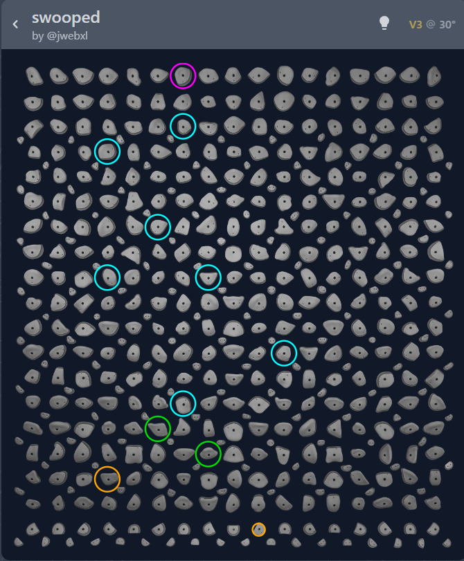
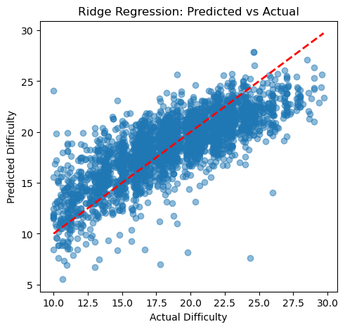
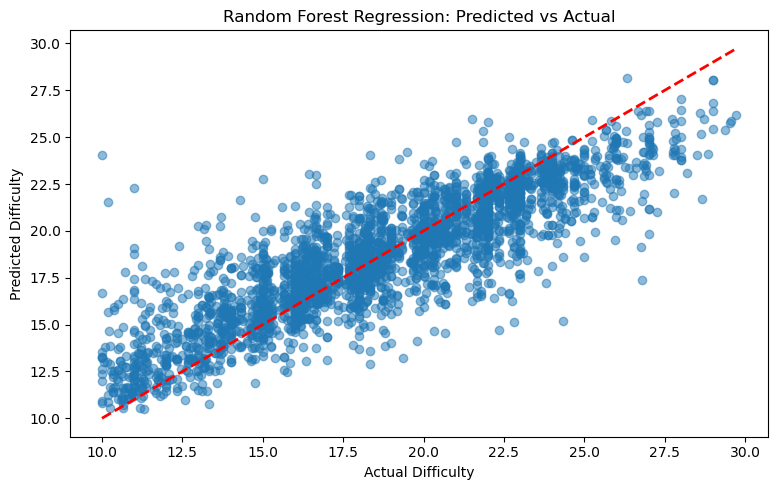
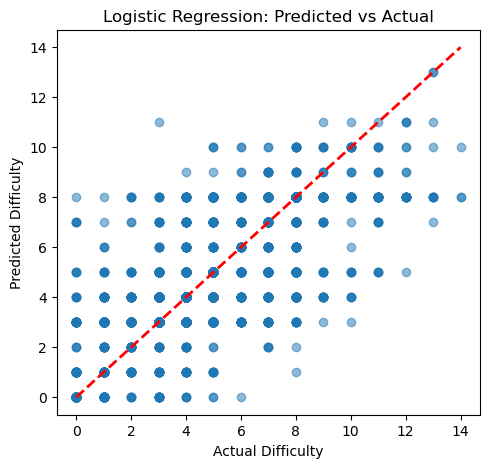
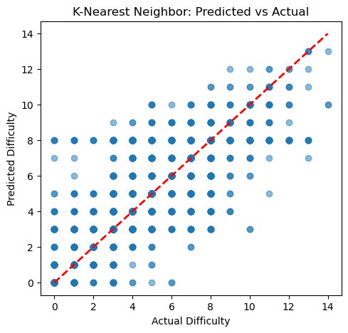
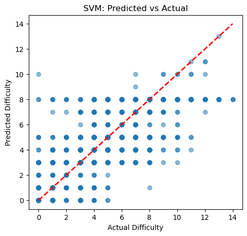

## 🧗 Climbing the Data Wall: A Machine Learning Approach to Bouldering Difficulty Prediction 
#### By: Jose Antonio Soto Villacampa
---

### 📖 Executive summary

#### Project overview and goals

This project investigates whether machine learning techniques can accurately predict the difficulty grades of indoor bouldering problems on a Kilterboard. Using data sourced from [Kilterboard app](https://kilterboard.app) API and [Climbdex library](https://climbdex.com), encompassing over 20,000 climbing problems with metadata on angles, hold types, ascents, and average difficulty ratings. The study explores both __regression__ and __classification__ models to predict grades. By treating difficulty as a continuous value (_regression_) or grouping it into categories (_classification_), this research evaluates the effectiveness of various machine learning approaches.

#### Significance

Grading inconsistencies on Kilterboards can hinder climbers' training, mislead them about their skill levels, and increase the risk of overtraining or injury. An objective, data-driven grading system could improve grade consistency, reliability, and overall training outcomes. Additionally, such a system can serve as a valuable tool for route setters to verify and fine-tune problem difficulty, enhancing the Kilterboard experience for climbers worldwide.

---

### 🔍 Research Question

Can we accurately predict the difficulty grade of indoor bouldering problems on a Kilterboard using machine learning techniques, based on the spatial configuration of holds, angles, and user feedback?

---

### Findings

The analysis of different machine learning approaches to predict climbing grades revealed compelling insights into both the capabilities and limitations of automated grading systems. Through extensive testing of multiple models, I found that machine learning can effectively capture many of the subtle factors that contribute to climbing difficulty, achieving prediction accuracies that align well with human-grade variations. The results demonstrate that while perfect grade prediction remains challenging due to the inherent subjectivity of climbing grades, machine learning models can provide valuable, consistent grading suggestions that could benefit both route setters and climbers.

#### Model Performance Hierarchy
- Random Forest Regression emerged as the best performing model overall:
    * Highest R-squared value (0.73)
    * Best accuracy within ±1 V-grade (76.40%)
    * Best accuracy within ±2 V-grades (91.90%)
- K-Nearest Neighbors performed best among classification models:
    * Highest exact grade match accuracy (41.17%)
    * Strong performance in ±1 and ±2 grade predictions

#### Regression vs. Classification Approaches
- Regression models showed superior performance in predicting grades within ranges
- Classification models performed better at exact grade matches

#### Grade Prediction Reliability
- All models showed significantly better performance when allowing for a ±1 or ±2 grade margin
- This aligns with real-world grade subjectivity where climbers often disagree within 1-2 grades
- Most reliable predictions were achieved within a ±2 grade range (80-91% accuracy)

---

### 📈 Results and conclusion 

#### Primary Conclusions
- Machine learning can effectively predict climbing grades with meaningful accuracy
- Random Forest Regression provides the most reliable predictions, especially within grade ranges
- The models' performance aligns well with real-world grade variation among climbers

#### Practical Applications
- The models can serve as effective tools for:
    * Initial grade suggestions for new problems
    * Identifying potentially misgraded problems
    * Providing consistent grading benchmarks
    * Supporting route setters in grade assignments

#### Limitations
- Perfect grade prediction remains challenging due to:
    * Inherent subjectivity in climbing grades
    * Variations in climber experience and style
    * Complex interactions between hold positions and angles

#### Achievement of Project Goals
- Successfully demonstrated the feasibility of machine learning for climbing grade prediction
- Provided quantifiable accuracy metrics for different prediction approaches
- Established a foundation for automated grading assistance systems

---

### 🔮 Future research and development

* Explore neural network or other more advanced ML approaches for feature extraction and prediction accuracy improvements.
* Investigate attention mechanisms to better understand hold relationships
* Create features that capture climbing movement patterns and sequences
* Incorporate additional climbing metrics like:
    - Hold depth and texture information
    - Dynamic vs. static move requirements
    - Climber height and reach data
* Collect and integrate video analysis data of successful ascents

#### Next steps and recommendations
* Optimize model performance for real-time predictions
* Continue tweaking and tuning model hyperparameters to achieve better prediction accuracy.

---

### Data Sources

**Dataset** 

The dataset was scraped from:

* [Kilterboard App](https://kilterboard.app) API: Over 20,000 records of climbing problems with metadata.
* [Climbdex Library](https://climbdex.com): Additional metadata on ascents and average difficulty ratings.

**Data Collection Process**

* The script used to scrape the data is available under [scripts/problem_extractor.py](scripts/problem_extractor.py).
* Scraped data is stored in `climbs_data.json`.

**Data Cleaning and Preparation**

* The positions of LED holds were flattened, and grades per angle were expanded.
* Kilter layout was filtered to include only the most common and complete layout (Type 1).
* Entries with missing critical data were removed.
* Processed data is stored in a `.parquet` format for efficiency: [data/climbs_data.parquet](data/climbs_data.parquet).
* The transformation script is included in [scripts/jsontransformer.py](scripts/jsontransformer.py).

***Data characteristics:***
- Total records: 35,878 climbing problems
- Features: 482 columns including:
  * UUID (unique identifier)
  * Angle (0-70 degrees)
  * Difficulty average (10-33)
  * Boulder grade (V0-V14)
  * Ascensionist count (1-1547)
  * LED positions (477 possible positions)

**Preprocessing:**

1. Removed unnecessary columns (UUID)
2. Filtered problems to include only those with 3 or more ascensionists for grade reliability
3. Converted boulder grades to numeric values (V0=0, V1=1, etc.)
4. One-hot encoded categorical variables (hold types)
5. Applied RobustScaler to numeric features
6. Implemented feature selection using SelectKBest

**Final Dataset:** 

- Total records: 14,320 climbing problems (after filtering for 3+ ascensionists)
- Features: 1,833 columns including:
  * Numeric features:
    - Angle (0-70 degrees, scaled using RobustScaler)
  * Categorical features (one-hot encoded):
    - 1,832 binary columns representing LED positions and their possible states:
      * FEET-ONLY
      * MIDDLE
      * NOT_USED
      * START
      * FINISH
- Target variables:
  * For regression: difficulty_average (continuous value)
  * For classification: grade_numeric (0-14, corresponding to V0-V14)
- Memory usage: 25.2 MB
- Data characteristics:
  * Angle distribution:
    - Mean: 37.50°
    - Standard deviation: 13.25°
    - Range: 0° to 70°

---

### ☑️ Methodology

This project followed a comprehensive machine learning approach, implementing both regression and classification models to predict climbing grades. The methodology consisted of several key phases: data preprocessing, model selection, training, and evaluation. I used a train-test split of 80-20 to ensure robust model validation, and implemented cross-validation during training to prevent overfitting. Feature selection was performed using `SelectKBest` to identify the most relevant features for prediction, and hyperparameter tuning was conducted through `GridSearchCV` to optimize model performance.

The evaluation metrics were carefully chosen to reflect real-world climbing grade assessment: besides traditional metrics like `MSE` and `R-squared` for regression models and `accuracy` for classification models, I included custom metrics to measure predictions within `±1` and `±2` grades, acknowledging the inherent subjectivity in climbing grades.

#### Regression Models Used

1. Ridge Regression:
    - Pipeline including RobustScaler and SelectKBest feature selection
    - Hyperparameters tuned:
        * Feature selection `k: [100, 200, 300]`
        * Alpha: `[0.1, 1.0, 10.0, 100.0]`
    - Best parameters: `k=300, alpha=1.0`

2. Random Forest Regression:
    - Pipeline with preprocessor
    - Hyperparameters tuned:
        * n_estimators: `[100]`
        * max_depth: `[None, 20]`
        * min_samples_split: `[2]`
    - Best parameters: `max_depth=None, min_samples_split=2, n_estimators=100`

#### Classification Models Used

1. Logistic Regression Model:
    - Multi-class one-vs-rest strategy
    - Hyperparameters tuned:
        * `C: [1.0]`
        * `max_iter: [1000]`
    - Implemented with `SAGA` solver and parallel processing

2. K-Nearest Neighbors:
    - Pipeline including feature selection
    - Hyperparameters tuned:
        * Feature selection `k: [400, 800, 1000]`
        * n_neighbors: `[6, 7, 8, 9, 10]`
        * weights: `['uniform', 'distance']`
    - Best parameters: `n_neighbors=9, weights='distance', feature_selection_k=1000`

3. SVM:
    - RBF kernel
    - Hyperparameters tuned:
        * `Feature selection k: [800]`
        * `C: [10.0]`
        * `gamma: ['scale']`
    - Best parameters: `C=10.0, gamma='scale', k=800`
---

### 📊 Model evaluation and results 

#### Regression Models Performance:
1. Ridge Regression:
   - MSE: 6.52
   - R-squared: 0.62
   - Grade prediction accuracy:
     * Exact: 28.14%
     * Within ±1: 67.28%
     * Within ±2: 87.36%

2. Random Forest Regression:
   - MSE: 4.56
   - R-squared: 0.73
   - Grade prediction accuracy:
     * Exact: 37.08%
     * Within ±1: 76.40%
     * Within ±2: 91.90%

#### Classification Models Performance:
1. Logistic Regression:
   - Overall accuracy: 33.00%
   - Grade prediction accuracy:
     * Exact: 33.00%
     * Within ±1: 63.13%
     * Within ±2: 80.80%

2. K-Nearest Neighbors:
   - Overall accuracy: 41.17%
   - Grade prediction accuracy:
     * Exact: 41.17%
     * Within ±1: 70.22%
     * Within ±2: 84.36%

3. SVM:
   - Overall accuracy: 36.49%
   - Grade prediction accuracy:
     * Exact: 36.49%
     * Within ±1: 67.63%
     * Within ±2: 82.37%

#### Model Prediction Visualizations

Each scatter plot shows the relationship between predicted and actual difficulty grades:
- The diagonal red line represents perfect predictions
- Points above the line indicate overestimation
- Points below the line indicate underestimation

**Ridge Regression:**
- The spread of points shows prediction variance
- Dense clustering around the diagonal indicates better prediction accuracy
- Notable spread in middle grades (V4-V8) suggests more prediction uncertainty in this range

**Random Forest Regression:**
- Tighter clustering around the diagonal compared to Ridge Regression
- More consistent predictions across grade ranges
- Less extreme outliers, particularly in higher grades
- Better performance in middle grades (V4-V8)
- Some prediction bias towards the mean in extreme grades

**Logistic Regression:**
- Discrete prediction pattern due to classification approach
- Strong diagonal trend indicating general accuracy
- Notable vertical banding showing classification boundaries
- Some grade ranges show better prediction consistency than others
- Higher grades show more prediction scatter

**K-Nearest Neighbors:**
- Clear step-like pattern due to discrete classification
- Good prediction density along the diagonal
- Fewer extreme misclassifications
- Balanced performance across grade ranges
- Some tendency to predict common grades more frequently

**SVM:**
- Sharp classification boundaries visible
- More conservative in extreme grade predictions
- Strong central tendency in predictions
- Clear separation between grade clusters
- Some difficulty with rare grades

---

### 💾 Project Resources

* [Dataset](data/climbs_data.parquet) 
* [Project notebook](notebook/kilter_project.ipynb) 
* [Data scraping script](scripts/problem_extractor.py)
* [Data Transformer script](scripts/jsontransformer.py)

---

### 🪪 Contact and Further Information

* 🔗[LinkedIn Profile](https://www.linkedin.com/in/joseantoniosoto/)

