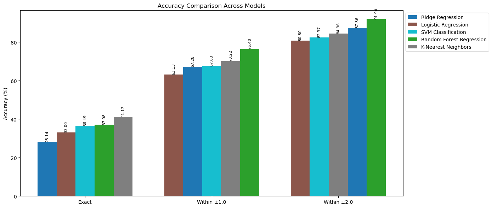

## 🧗 Climbing the Data Wall: A Machine Learning Approach to Bouldering Difficulty Prediction ##
### By: Jose Antonio Soto Villacampa ###
---

### 📖 Executive summary

**Project overview and goals** 

This project investigates whether machine learning techniques can accurately predict the difficulty grades of indoor bouldering problems on a Kilterboard. Using data sourced from the open Kilterboard API and Climbdex library—encompassing over 20,000 climbing problems with metadata on angles, hold types, ascents, and average difficulty ratings—the study explores both regression and classification models to predict grades. By treating difficulty as a continuous value (regression) or grouping it into categories (classification), this research evaluates the effectiveness of various machine learning approaches.

**Significance** 

Grading inconsistencies on Kilterboards can hinder climbers' training, mislead them about their skill levels, and increase the risk of overtraining or injury. An objective, data-driven grading system could improve grade consistency, reliability, and overall training outcomes. Additionally, such a system can serve as a valuable tool for route setters to verify and fine-tune problem difficulty, enhancing the Kilterboard experience for climbers worldwide.

---

**Findings:** 

**📈 Results and conclusion:** 

**🔮 Future research and development:** 

* Explore neural network approaches for feature extraction and prediction accuracy improvements.

**Next steps and recommendations:** 

---

### 🔍 Research Question

Can we accurately predict the difficulty grade of indoor bouldering problems on a Kilterboard using machine learning techniques, based on the spatial configuration of holds, angles, and user feedback?

### Data Sources

**Dataset** 

The dataset was scraped from:

* [Kilterboard App](https://kilterboard.app) API: Over 20,000 records of climbing problems with metadata.
* [Climbdex Library](https://climbdex.com): Additional metadata on ascents and average difficulty ratings.

**Data Collection Process**

* The script used to scrape the data is available under [scripts/problem_extractor.py](scripts/problem_extractor.py).
* Scraped data is stored in `climbs_data.json`.

**Data Cleaning and Preparation**

* The positions of LED holds were flattened, and grades per angle were expanded.
* Kilter layout was filtered to include only the most common and complete layout (Type 1).
* Entries with missing critical data were removed.
* Processed data is stored in a `.parquet` format for efficiency: [data/climbs_data.parquet](data/climbs_data.parquet).
* The transformation script is included in [scripts/jsontransformer.py](scripts/jsontransformer.py).

TODO: Add here some details on the parquet data

**Preprocessing:**

TODO: Add more details here on the preprocessing done before passing it to the models

**Final Dataset:** 

TODO: Add more details here about the actual dataset at the end

---

### ☑️ Methodology

#### Regression Models Used

**Ridge Regression:**

**Random Forest Regression:**

#### Classification Models Used

**Logistic Regression Model:**

**K-Nearest Neighbors:**

**SVM:** 

---

### 📊 Model evaluation and results 

---

### 💾 Project Resources

* [Dataset](data/climbs_data.parquet) 
* [Project notebook](notebook/kilter_project.ipynb) 
* [Data scraping script](scripts/problem_extractor.py)
* [Data Transformer script](scripts/jsontransformer.py)

---

### 🪪 Contact and Further Information

* [LinkedIn](https://www.linkedin.com/in/joseantoniosoto/)

